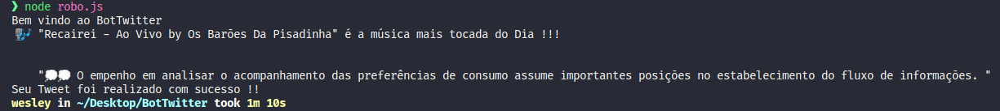

<h1 align="center"> <strong>🤖 BotTwitter</strong></h1>

<p align="center">
  
 
</p>

<p align="center">
</p>

<br />
<p align="center"></p>

<br />

# 📕 About
🤖 A robot made with Puppeteer to make publish on Twitter a Tweet of the most played song on Spotify along with a random phrase.
</br>

# 🛠️Technologies 

This project was made using the follow technologies:

- [NodeJS](https://nodejs.org/en/)
- [Puppeteer](https://github.com/puppeteer/puppeteer)
- [VS Code](https://code.visualstudio.com/)


# 🚀Features


* 🎶  Catch the most played music of the day on Spotify Brazil.
* 🔀 Generate a random phrase from the website [LeroLero](https://lerolero.com/).
* 🐦 Login to Twitter and post the Tweet automatically with the extracted information.


# 🏃Getting Started
```sh
#  Clone Repository
$ git clone  https://github.com/wesleywcr/BotTwitter.git
```
```sh
# Install Dependencies
$ yarn install
# Start application
$ node robo.js 
```

# 🤝 Contributing

- Fork this repository
- Create a branch with your feature: `git checkout -b my-feature`
- Commit your changes: `git commit -m 'feat: My new feature'`
- Push your branch: `git push origin my-feature`

# 📝License

Released in 2020.
This project is under the [MIT license](./LICENSE)
Made with ❤️ by [Wesley Rodrigues](https://github.com/wesleywcr)🤙👊
